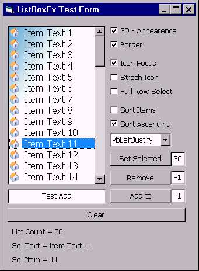



## ListBoxEx V1 \- Upgraded Version for VBListBox

### Description

This is an upgraded version for VBListBox ActiveX, with 'ListIcons'. This version is fully customizable and aims for a clear and simple code. A powerful 'ItemSort', 'TextAllinement', 'Icon Focus' and 'FullRow select' are included in this version. Feel free to use it, visualize more features and give me feedbacks. Good Luck!
 
### More Info
 

             |
---                |---
**Submitted On**   |2004-01-26 09:57:12
**By**             |[JJJJJJJJ](https://github.com/Planet-Source-Code/PSCIndex/blob/master/ByAuthor/jjjjjjjj.md)
**Level**          |Intermediate
**User Rating**    |5.0 (45 globes from 9 users)
**Compatibility**  |VB 6\.0
**Category**       |[Custom Controls/ Forms/  Menus](https://github.com/Planet-Source-Code/PSCIndex/blob/master/ByCategory/custom-controls-forms-menus__1-4.md)
**World**          |[Visual Basic](https://github.com/Planet-Source-Code/PSCIndex/blob/master/ByWorld/visual-basic.md)
**Archive File**   |[ListBoxEx\_189684642005\.zip](https://github.com/Planet-Source-Code/jjjjjjjj-listboxex-v1-upgraded-version-for-vblistbox__1-60901/archive/master.zip)

